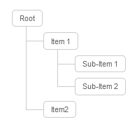

# markdown-it-treelist

[](https://www.npmjs.com/package/markdown-it-treelist) [](https://github.com/Bioruebe/markdown-it-treelist/actions/workflows/node.js.yml) 

> A markdown-it plugin, which adds tree-styled lists

## Preview



## Usage

### Install

```bash
npm install markdown-it-treelist
```

### Enable

```js
// ESM
import MarkdownIt from "markdown-it";
import MarkdownItTreelist from "markdown-it-treelist";
const md = new MarkdownIt().use(MarkdownItTreelist, options);

// CommonJS
const markdown_it = require("markdown-it");
const markdown_it_treelist = require("markdown-it-treelist");
const md = markdown_it().use(markdown_it_treelist, options);
```

### Syntax

Each treelist must start with a single root element without indention or list marker. Then, one or more list items starting with `+--` can follow. Use indention to create a new sub-tree. Inline markdown formatting is possible.

```md
root
+-- item1
    +-- sub-item1
+-- item2
```

is interpreted as

```html
<div class="mdi-tree">
  <ul>
    <li>
      <span class="mdi-tree-root">root</span>
      <ul>
        <li>
          <span class="mdi-tree-node">item1</span>
          <ul>
            <li><span class="mdi-tree-leaf">sub-item1</span></li>
          </ul>
        </li>
        <li>
          <span class="mdi-tree-leaf">item2</span>
        </li>
      </ul>
    </li>
  </ul>
</div>
```

### Example SCSS

```scss
$lineColor: #666;
$lineColorHover: #a5a5a5;
$textColorHover: darken($lineColorHover, 25%);
$font: arial, verdana, tahoma;

/* The height of a list node, e.g. to make the list more/less compact */
$itemHeight: 4px;

/** The padding of each list item */
$paddingItem: $itemHeight 5px 0px 5px;

/** The padding of the leaf's boxes */
$paddingBox: 2px 10px;


.mdi-tree {
    ul {
        padding-left: revert;
    }

    li {
        margin: 0px 0;
        list-style-type: none;
        position: relative;
        padding: $paddingItem;

        &::before {
            content: "";
            position: absolute;
            top: 0;
            width: 1px;
            height: 100%;
            right: auto;
            left: -20px;
            border-left: 1px solid #ccc;
            bottom: 50px;
        }

        &::after {
            content: "";
            position: absolute;
            top: 16px + $itemHeight;
            width: 25px;
            height: 20px;
            right: auto;
            left: -20px;
            border-top: 1px solid #ccc;
        }

        span {
            display: inline-block;
            border: 1px solid #ccc;
            padding: $paddingBox;
            text-decoration: none;
            color: $lineColor;
            font-family: $font;
            font-size: 11px;
            border-radius: 5px;
        }

        /* Remove connectors after last child */
        &:last-child {
            &::before {
                height: 16px + $itemHeight;
            }
        }

        /* Change color on hover */
        .mdi-tree-node {
            &:hover {
                color: $textColorHover;
                border: 1px solid $lineColorHover;
            }

            &:hover+ul {
                li {
                    span {
                        color: $textColorHover;
                        border: 1px solid $lineColorHover;
                    }

                    &::after {
                        border-color: $lineColorHover;
                    }

                    &::before {
                        border-color: $lineColorHover;
                    }
                }

                &::before {
                    border-color: $lineColorHover;
                }

                ul {
                    &::before {
                        border-color: $lineColorHover;
                    }
                }
            }
        }
    }

    /* Don't apply style to root node */
    >ul {
        margin: 0;
        padding: 0;

        >li {
            padding-top: 0;

            &::before {
                border: 0;
            }

            &::after {
                border: 0;
            }
        }
    }
}
```
